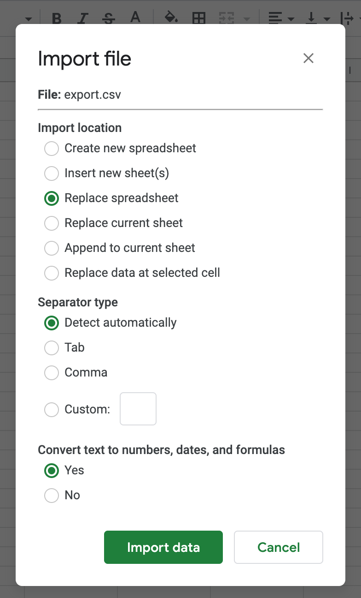
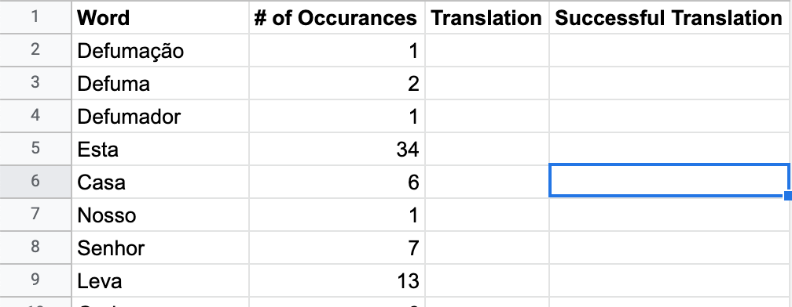
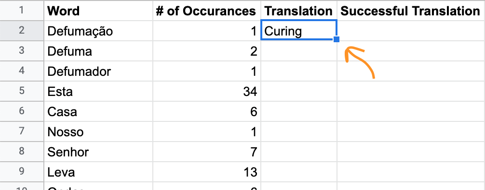

# Foregin Language Learning Accelerator
Language acquisition is hard. This set of ruby scripts aims to make it a little bit easier.

## The Idea
Language learning can get boring, so its important to learn from things that interest us.
This set of scripts can read a PDF file, and output a list of words along with their usage frequency.

You can combine this with a little bit of Google Sheets wizardy and get yourself a list of the most frequently occuring
words in the document along with their translation.

## How to Use It

1. Clone the repository and change your directory to the newly cloned repo.

```bash
git clone https://github.com/realstorypro/language-accelerator.git
```

2. Run bundler to download dependencies.
```bash
bundle
```

3. Copy the PDF you'd like to use and rename it to input.pdf
4. Convert the PDF into text file.
```bash
ruby conver.rb

## input.txt file will be created.
```

5. If the PDF you've inputted has a cover or a table of content it will be included in the input.txt
You can open the file and manually remove the lines you wish to be excluded from the frequency count.
   
6. Create a word frequency CSV import for Google Spreadsheets.
```bash
ruby frequency.rb
## export.txt file will be created.
```

## Google Spreadsheets
1. Import the file to Google Spreadsheets by heading over to __File__ menu and choosing __Import__.
2. You will be presented with an import dialog box. Keep the defaults.

{:height="20%" width="20%"}

3. Add a header row above the newly inserted data.

   
4. Add the following formula under the cell C2
```bash
=PROPER(GOOGLETRANSLATE(A2,"auto","en"))
```
5. Click on the blue dot, to copy the formula all the way down to the end.



#### LICENSE
This project is licensed under the terms of the MIT license.
